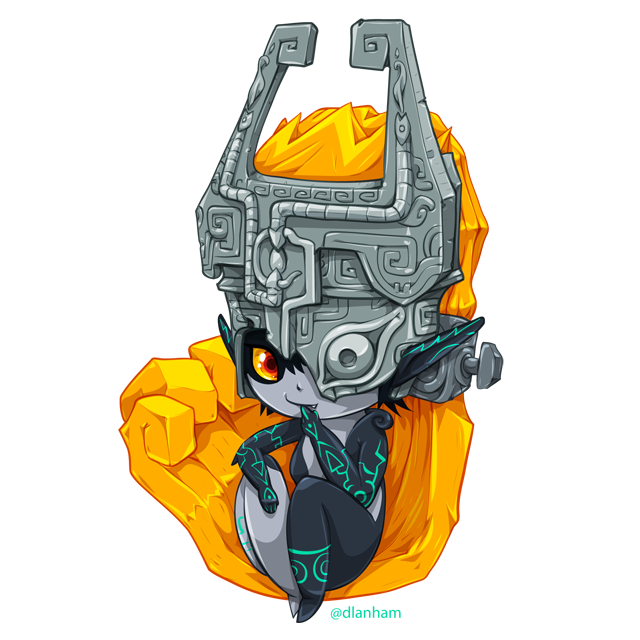

<div style="text-align: center">
  
</div>

# @midnabot
[]()
[](https://t.me/midnabot)

## Commands

### [Sandbox](https://github.com/gf3/sandbox)
Execute JavaScript code
```
/sandbox ```console.log('Hello world')```
```

### [Roll](https://github.com/troygoode/node-roll)
Roll dices
```
/roll 2d10
```
